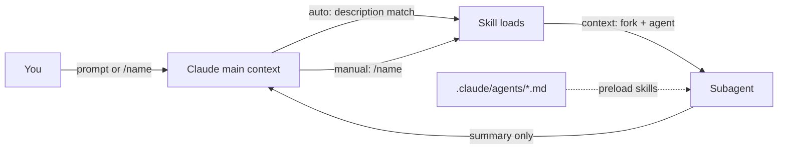
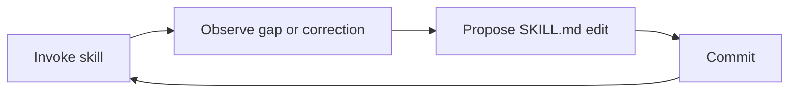
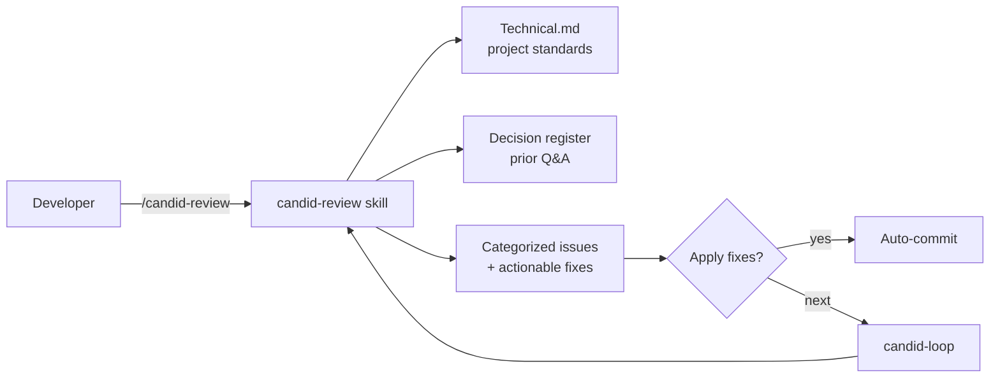

<!-- _class: lead title -->

# Claude Code Skills

## Skills are the new skill

Ron Myers · May 14, 2026 · PEI Devs

<!--
-->

---

# Each Era Shrinks the Loop

| Year | Shift |
|---|---|
| **1997** | RTFM. Books, dial-up, BBS forums. Hope the manual covers your edge case. |
| **1998** | Google launches. Search beats searching. |
| **2000** | IntelliSense matures. The IDE starts finishing your sentences. |
| **2005** | Git. Branching stops being scary. |
| **2008** | Stack Overflow + GitHub. Your error message is now a hyperlink. |
| **2009** | npm + modern package management. `install` replaces a weekend. |
| **2013** | Docker. "Works on my machine" stops being a punchline. |
| **2022** | ChatGPT. The whole industry feels the shift. |
| **2025** | Claude Code + Skills. You write the playbook, not the keystrokes. |
| **2026** | Code AGI? (so many fast-moving things). |

<!--
Speaker notes:

This is the runway slide. Every era of dev tooling did the same thing — shrank the loop between intent and result. RTFM → Google was the first 10x. IntelliSense killed lookup. Git killed fear of branching. Stack Overflow turned errors into hyperlinks. npm killed the weekend-long install. Docker killed environment drift. ChatGPT was the inflection — natural language as a programming surface. Now Claude Code + Skills closes the next gap: you stop typing the same prompt twice. Each era removed a category of friction. Skills remove repetition of *thought*.

Pace: 30-40 seconds. Don't read the table line by line — pick three landmarks (Google, Stack Overflow, ChatGPT) and let the rest sit on the slide.
-->

---

# So what changed in 2025?

Every prior shift made **execution** cheaper.
*Type less. Search less. Configure less. Deploy less.*

2025 makes **judgment** reusable.

> You stop writing instructions for a session.
> You start writing instructions for **every future session**.

That's the gap Skills close.

<!--
Speaker notes:

This is the pivot. The whole previous timeline was about reducing keystrokes, lookups, friction — execution costs. Skills are different in kind: they let you persist *how you think* about a problem, not just how you do it. The thing you used to re-explain to a junior every Monday now lives in SKILL.md and explains itself.

Bridge line to next slide: "Which means the unit of reuse changes. We've moved from reusing logic to reusing expertise."
-->

---

# From Writing Logic to Encoding Judgment

<div class="columns">
<div>

**Code says:**
*"do these steps in this order."*

**Skill says:**
*"here's how to think about this problem."*

</div>
<div>

- A function is reusable **logic**
- A skill is reusable **expertise**
- Code packages **mechanism**
- Skills package **process**

</div>
</div>

<span class="small">Twenty years writing imperative steps for a machine. Skills invert it — you're not writing what to do, you're writing how to decide. The skill isn't the work. It's the playbook the worker reads first.</span>

<!--
Reframe slide. Sets the philosophical pivot before the "typed it twice" rule. Logic → judgment, mechanism → taste.
-->

---

# Typed the same prompt twice? Write a skill.

```
You: Run a code review as a senior architect, sitting with the software developer and UX.
You: Merge to stable

You: Run a pull request review as a senior architect, sitting with the software developer and UX.
You: Merge to stable


                      ↓
                  SKILL.md
```

**Same prompt. Same checklist. Same procedure.**
The second time tells you the shape. The third time, you're losing.

<span class="small">This is the whole talk. The rest is mechanics.</span>

<!--
Thesis slide. Frame the entire deck around the moment of recognition: "I've typed this before." Everything that follows - primitives, frontmatter, candid - is in service of this rule.
-->

---

# Three primitives

<div class="columns3">
<div>

### Skills

*Reusable knowledge or workflow.*

What Claude **knows how to do**.

</div>
<div>

### Commands

*Manual prompt shortcuts.*

What you **fire on demand**.

</div>
<div>

### Subagents

*Isolated AI sessions.*

Where **context lives**.

</div>
</div>

<!--
Pure orientation slide. Get the three terms in front of the audience before going deep on each.
-->

---

# Skills

**Reusable knowledge Claude can pick up when it's needed.**

- **Auto-triggered** when your prompt matches the skill's `description`.
- Or invoke explicitly: `/skill-name`.
- **Progressive disclosure** — only the description sits in context until the skill fires. Body loads on use.

<span class="small">Examples: a code review procedure, project standards, an anti-pattern checklist, a deploy sequence.</span>

<!--
"Skills are reusable prompts with structure" - TDS. The progressive-disclosure point is the technical edge over CLAUDE.md.
-->

---

# Commands

**Manual prompt shortcuts. You always type `/name`.**

- **Built-in:** `/compact`, `/login`, `/model`, `/agents`.
- **Custom commands now *are* skills.** `.claude/commands/x.md` and `.claude/skills/x/SKILL.md` both produce `/x`.
- Use for **surgical, side-effectful actions**: deploy, commit, ship. Things Claude shouldn't decide to do for you.

<span class="small">Set `disable-model-invocation: true` on a skill to make it command-only — Claude never auto-fires it.</span>

<!--
Audience members with .claude/commands/ may not realize they're already in skill territory.
-->

---

# Subagents

**Isolated AI session with a fresh context window.**

- **Spawn:** `/agents`, or any skill with `context: fork`.
- **Returns a summary**, not its scratch work. Main context stays lean.
- **Composable:** preload skills into a subagent via `.claude/agents/<name>.md` frontmatter.

<span class="small">Use for: codebase-wide analysis, parallel exploration (API + payments in one prompt), heavy debugging — anything that would otherwise blow your main context.</span>

<!--
Subagents are how you do "big work" without paying the token cost in the main thread. The composition with skills is the killer feature.
-->

---

# How they compose



- A **command** is a skill you trigger explicitly.
- A **skill** can fork into a **subagent**.
- A **subagent** can preload skills via its frontmatter.

<span class="small">Skills follow the open [Agent Skills](https://agentskills.io) standard — cross-tool.</span>

<!--
The point: these aren't three separate features. They nest. A custom command IS a skill. A skill CAN run as a subagent. A subagent CAN preload skills. Composition is the killer feature.
-->

---

# What is a skill?

> *Create a `SKILL.md` file with instructions, and Claude adds it to its toolkit.* — Anthropic

```yaml
---
description: Summarize uncommitted changes and flag risk. Use when the user asks what changed.
---

## Current changes
!`git diff HEAD`

## Instructions
Summarize in 2-3 bullets, then list risks.
```

<span class="small">Keep `SKILL.md` under ~500 lines. Move detail to `references/`.</span>

<!--
The minimal SKILL.md does real work: frontmatter, dynamic context injection via !, instructions. This is the whole shape.
-->

---

# Skills vs CLAUDE.md vs prompts

<div class="columns3">
<div>

**Prompt**

Lives in chat.
Re-derived every time.
Lost to compaction.

</div>
<div>

**CLAUDE.md**

Always loaded.
Pays tokens every turn.
Best for facts.

</div>
<div>

**Skill**

Loads on invoke.
"Free" until used.
Best for procedures.

</div>
</div>

> *"Unlike CLAUDE.md content, a skill's body loads only when it's used, so long reference material costs almost nothing until you need it."* — Anthropic

<!--
This is the mental model slide. The whole talk hinges here.
-->

---

# Discovery, invocation, lifecycle

- **Auto:** Claude matches your prompt against each skill's `description`.
- **Manual:** type `/skill-name` (or `/skill-name arg1 arg2`).
- **Conservative by default.** A weak description = the skill never triggers.
- **Sticky context.** Once loaded, the body stays in context for the rest of the session.

Every line of `SKILL.md` is a recurring token cost.

<!--
The "sticky context" point is the one most users miss. Implication: keep skills lean.
-->

---

# Frontmatter + where skills live

<div class="columns">
<div>

**The 6 levers**

| Field | Use |
|---|---|
| `description` | Trigger matching |
| `disable-model-invocation` | Manual only |
| `user-invocable: false` | Background knowledge |
| `allowed-tools` | Pre-approve |
| `context: fork` | Subagent |
| `paths` | Auto-activate on glob |

</div>
<div>

**Precedence** (high → low)

1. Enterprise
2. Personal `~/.claude/skills/`
3. Project `.claude/skills/`

Plugin skills: `plugin:skill` namespace, no conflict.

Live edits reload mid-session.

</div>
</div>

<!--
Not the full reference - the levers Ron actually reaches for.
-->

---

# When to write a skill

> *Create a skill when you keep pasting the same instructions, checklist, or multi-step procedure into chat — or when a section of CLAUDE.md has grown into a procedure rather than a fact.*
> — Anthropic

**Rule of thumb:** repeated pain, not speculation.

<span class="small">If you haven't hit the problem twice, you don't know the shape of the skill yet.</span>

<!--
Opinion #2 lands here. Don't pre-build skills for problems you haven't hit.
-->

---

# Three patterns

<div class="columns3">
<div>

**A — Prompt only**

Claude's judgment is enough.

<span class="small">Underused.</span>

</div>
<div>

**B — + Scripts**

Deterministic work: calc, validation, file munging.

</div>
<div>

**C — + MCP/Subagent**

External APIs, isolated context, `context: fork`.

</div>
</div>

**Start at A. Evolve to B. Reach for C only when you must.**

<span class="small">Simplifying an over-engineered skill is harder than adding a script later.</span>

<!--
TDS framing. Saves teams from premature complexity.
-->

---

# The description is the trigger

```yaml
description: Summarize uncommitted changes and flag risk.
  Use when the user asks what changed, wants a commit
  message, or asks to review their diff.
```

- **Put the key use case first.** Truncated at 1,536 chars.
- **Be "pushy."** List trigger phrases verbatim.
- Total listing budget ≈ 1% of context window.

> *"If the description is not well designed, the Skill will not even trigger."* — TDS

<!--
Number-one reason skills fail. People write descriptions like they're documenting; you're writing for a matcher.
-->

---

# Advanced levers

**Dynamic context injection** — runs before Claude sees the prompt

```yaml
## PR diff
!`gh pr diff`
```

**Subagent execution** — isolated context

```yaml
context: fork
agent: Explore
```

**Tool pre-approval** — no per-use prompts

```yaml
allowed-tools: Bash(git add *) Bash(git commit *)
```

<!--
One-liner each. Each unlocks a category of skill that's hard otherwise.
-->

---

<!-- _class: lead -->

# What skills can actually do

### It's not just a prompt with extra steps.

<span class="small">Next 7 slides: capabilities you might not know skills have.</span>

<!--
Section divider. The deck so far covered what a skill IS. Next section: what one can DO. Examples grounded in real candid skills.
-->

---

# Skills can loop

```
WHILE iteration < maxIterations:
  /candid-review            # find issues
  apply fixes               # fix them
  IF no issues remaining:
    BREAK
```

`candid-loop` runs `/candid-review` until clean (or max hit). Modes: **auto**, **review-each**, **interactive**.

<span class="small">Source: [candid/skills/candid-loop/SKILL.md](https://github.com/ron-myers/candid/blob/stable/skills/candid-loop/SKILL.md)</span>

<!--
Skills aren't single-shot. They can iterate to convergence.
-->

---

# Skills can call CLI tools

```yaml
---
allowed-tools: Bash(git *) Bash(gh *) Bash(jq *)
---

## Diff
!`git diff HEAD`

## Open PR comments
!`gh pr view --comments`
```

`` !`cmd` `` runs **before** Claude sees the prompt. Output gets inlined.

<span class="small">`allowed-tools` pre-approves so no per-use permission prompts.</span>

<!--
The shell is part of the prompt now. Dynamic context injection is the killer feature most people miss.
-->

---

# Skills can take arguments

```yaml
---
description: Migrate a component between frameworks
argument-hint: [component] [from] [to]
arguments: [component, from, to]
---

Migrate the $component from $from to $to.
Preserve all existing behavior and tests.
```

```
/migrate-component SearchBar React Vue
```

Positional: `$0`, `$1`, `$2`. Full string: `$ARGUMENTS`. Named: declared in frontmatter.

<span class="small">CLI-style flags work too: `/candid-loop --mode auto --max-iterations 3 --categories critical,major`</span>

<!--
Skills aren't fixed prompts - they're parameterized. argument-hint shows up in autocomplete; arguments names the positional slots.
-->

---

# Skills can read configuration

**Precedence:** CLI flags → project `.candid/config.json` → user `~/.candid/config.json` → defaults

```bash
jq -r '.loop.mode // "auto"' .candid/config.json
```

```json
{ "tone": "harsh", "loop": { "mode": "auto", "maxIterations": 5 } }
```

Same skill. Different teams. Different behavior. No code change.

<!--
Configurability without rewriting the skill. Persisted per-project or per-user.
-->

---

# Skills can use MCP servers

`candid-chrome-qa` drives a real Chrome session via the `claude-in-chrome` MCP:

```
mcp__claude-in-chrome__navigate
mcp__claude-in-chrome__find
mcp__claude-in-chrome__get_page_text
mcp__claude-in-chrome__read_console_messages
```

The skill orchestrates. The MCP gives it **hands**.

<span class="small">Outputs structured findings JSON to `.context/findings/<date>-<slug>.json`.</span>

<!--
MCP servers expose tools; skills compose them into workflows. This is how skills reach outside the model.
-->

---

# Skills can ask you questions

```
[1/4] 🔥 Critical: Race condition in checkout flow
File: src/checkout.ts:142

  How would you like to handle this issue?
    1. Apply fix
    2. Skip
    3. Add to ignore list
    4. Skip all remaining
```

`AskUserQuestion` pauses the skill mid-flow for structured input.

<span class="small">Skills aren't fire-and-forget — they can be interactive.</span>

<!--
candid-loop uses this in interactive mode. The skill becomes a CLI app, not a monologue.
-->

---

# Skills can run logic

```
IF mode == "auto":
    apply all fixes

ELSE IF mode == "review-each":
    FOR each issue:
        AskUserQuestion("Apply this?")

ELSE:  # interactive
    full skip / ignore / batch flow
```

`if`, `else`, `for`, `while`, `switch`. Pattern-match. Filter. **Skills are programs Claude executes.**

<!--
The skill body is markdown, but the model treats control flow as code. That's why candid-loop has 537 lines of mostly logic.
-->

---

# Skills can invoke other skills

```
candid-loop
   └→ /candid-review
         └→ reads .candid/last-review.json
         └→ uses /candid-init if no Technical.md
   └→ AskUserQuestion (interactive mode)
   └→ writes back to .candid/config.json
```

Small skills compose into bigger workflows. **Like functions calling functions, but with prompts.**

<span class="small">candid ships 10 skills; only 3 are usually invoked directly.</span>

<!--
This is the part people underestimate. Skills are not isolated files — they're a tree.
-->

---

# Self-improving skills

A skill that updates **itself**.



**Three flavors:**
- **Reactive** — user correction → append rule
- **Failure-driven** — rejected output → propose description tweak
- **Meta-skill** — `/improve-skill` reads transcripts + diffs `SKILL.md`

<span class="small">Bridges "wrote a skill once" → "skills compound over time."</span>

<!--
Source: youtube.com/watch?v=wQ0duoTeAAU. Transcript wasn't fetchable; pattern described from first principles.
-->

---

# 5 skills I use daily

| Skill | Problem it solves |
|---|---|
| **caveman** | Long sessions bloat context — cuts token use ~75% |
| **superpowers** <span class="small">(Obra)</span> | Claude skips process on "simple" tasks; makes TDD/brainstorm/plan non-negotiable |
| **planning with files** | Plans-in-chat die to compaction; plans-in-files persist, diff, PR |
| **Remotion Best Practices** | Claude reinvents Remotion idioms each session — codify them |
| **candid** | A skill I built and published |

<!--
Show, don't tell. These are real skills Ron uses. Audience leaves with concrete things to try.
-->

---

# candid.tools — the pain

AI code review usually lands one of two ways:

- **Too soft** — feels nice, ships bugs.
- **Too brutal** — gets ignored.

And nobody's project standards are enforced consistently. They live in heads and PR comments.

**I kept typing the same review prompt. Then I wrote it down.**

<!--
Frame the pain in two halves to match the two-axis solution (tone toggle + Technical.md).
-->

---

# candid — what it is



10 skills. Configurable tone (Radical Candor — care personally, challenge directly). Runs on Claude Code and Codex CLI.

<!--
{{CANDID_TAGLINE}} placeholder unused - README's "AI-powered code reviews that catch issues before production while teaching you better patterns" works.
-->

---

<div class="demo">🎬 LIVE DEMO</div>

If the demo fails, narrate this:

- Run `/candid-review --harsh` on a dirty branch
- Show categorized issues + confidence-rated fixes
- Select 2 issues → tracked as todos
- Apply fix → auto-commit with detailed message
- Re-run → decision register skips already-answered questions

<!--
Always have the fallback. Demos fail.
-->

---

# Lessons from candid

1. **The skill *is* the workflow.** Not a one-shot — chained calls (review → loop → ship).
2. **Configurability beats cleverness.** A tone flag did more than a smarter prompt.
3. **Standards live in a file, not a head.** `Technical.md` makes the review reproducible.

<!--
Tie back to opinions: codify > prompt; pain-first; team multiplier.
-->

---

# Start a skills repo

<div class="columns">
<div>

**Personal**

```
~/personal-skills/
  caveman/SKILL.md
  plan-with-files/SKILL.md
  remotion-best/SKILL.md
```

Synced into `~/.claude/skills/` (symlink or sync script).

Versioned. Portable.

</div>
<div>

**Team**

```
your-team-repo/
  .claude/skills/
    deploy/SKILL.md
    incident/SKILL.md
    on-call/SKILL.md
```

Or ship as a plugin. Every teammate's Claude session loads the same workflows.

</div>
</div>

**Homework: by end of this week, your personal skills repo has at least one skill in it.**

<!--
Concrete call-to-action. Don't leave the room without committing to this.
-->

---

# Three takeaways

1. **Skills > prompts.** Codify a workflow once instead of re-deriving it every chat.

2. **Build for repeated pain, not speculation.** Two hits, then write the skill.

3. **Skills are team multipliers.** Share them like libraries. Personal repo + team repo.

<!--
The whole talk in three lines. Slow down here.
-->

---

# Q&A · Resources

- **Official docs:** [code.claude.com/docs/en/skills](https://code.claude.com/docs/en/skills)
- **candid:** [github.com/ron-myers/candid](https://github.com/ron-myers/candid) · [candid.tools](https://www.candid.tools)
- **superpowers:** [github.com/obra](https://github.com/obra)
- **TDS — production-ready skills:** [towardsdatascience.com](https://towardsdatascience.com/how-to-build-a-production-ready-claude-code-skill/)
- **Self-improving skills (video):** [youtube.com/watch?v=wQ0duoTeAAU](https://www.youtube.com/watch?v=wQ0duoTeAAU)

**Contact:** www.linkedin.com/in/ronkmyers/

<!--
Five minutes for Q&A. Anticipate: "how do I write the description?" "when does Claude actually trigger it?" "what's the simplest skill I should write first?"
-->
